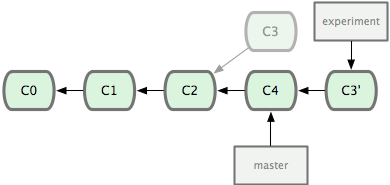
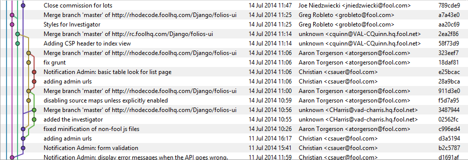
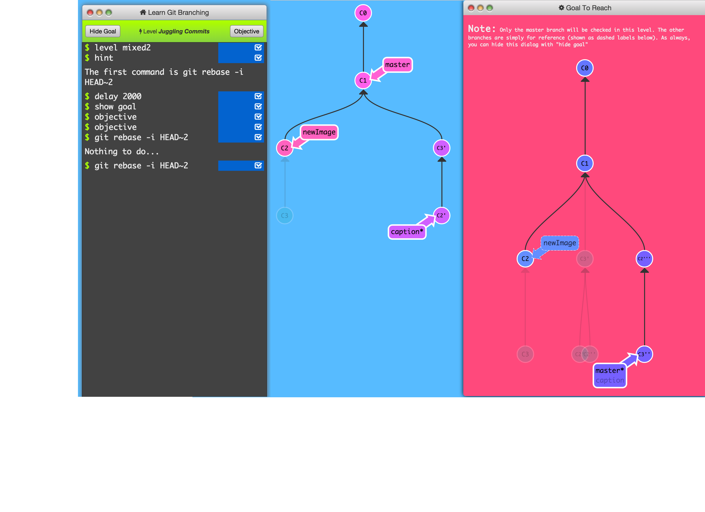

footer: © The Motley Fool, 2014
slidenumbers: true

# Advanced Git

---
## Why Go Beyond Merge?

- "Those who cannot remember the past are condemned to repeat it."
- Improves teamwork, collaboration, and communication

---

## Good Commits

---

### What Makes a Good Commit

- Related to just one "changeset"
    - Easy to review
    - Easy to revert

---

## Good Commit Messages

---

### Not for You, for Your Coworkers

- You may be unavailable and unreachable (another dimension, a zombie, etc).
- You may not work here anymore.
- You may forget.

---

### Explain what the changes DO and WHY, not what the changes ARE

- Code and version control already shows *what* you changed
- Need to explain business/use case--what problem are you solving?
- Include names of people, dates, etc of justification
- CYA!!

---

### Sample Template

```
Summarize what changes do < 50 chars

More detailed explanation, wrapping at ~72 chars, with an empty line between
the "title" and the "body". Explain motivation for changes, and describe
difference between previous state and current state.
- Optionally with bullet points

```

---

### Good Example

```
App icon color change for the business

Meeting with Tom Gardner on 15-Oct-1999.  He wants the icon to be 
cornflower blue. His reasoning: "Efficiency is priority 
number one, people.  Because waste is a thief"

Moving the control of the icon color to a setting in the config file
just in case he changes his mind.
```

^ Date, color, and quotes come from Fight Club.  Christian will award
500 gold to whomever names the reference.

---

### Bad Examples


---

## Local Branches
### Why always working on a branch makes life easier

---

### Branches are cheap!

- Branches are just pointers, easy to create and delete
- Edits on branch recorded as changes from branch point
- Many branches, single working copy


---

### You'll be prepared!

- Never know how long a change will take
- Working on multiple changes/fixes at the same time
- Easy to switch to emergency work
- Local master always reflects publicly-available code

---

### Easy to keep up-to-date!

- Pull often (rebase or merge, discussed later)
- Easier to deal with lots of small changes/conflicts, if any, daily

---

### Easy to remove!

- If and when priorities change mid-development, there's no annoying cleanup of now-irrelevant code on master
- Delete the branch, or keep it for reference/potential code reuse--either way, the master branch is uncluttered

---

### Examples

In the beginning:

```sh
$ git checkout -b fix-divide-by-zero origin/master  # descriptive branch name!
```

While working:

```sh
$ git pull  # or git pull --rebase
```

In the end:

```sh
$ git rebase -i
$ git checkout master
$ git merge -no-ff fix-divide-by-zero
$ git push
$ git branch -d fix-divide-by-zero
```

---


## Stash

---

### Squirrel!?

- Holding onto uncommitted changes without dirtying history
- Specific to the branch
- Multiple stashes possible, give them names
- Can be turned into branches
- Useful when need to pull latest without committing

---

### Examples

Simplest form

```sh
$ git stash        # or git stash "name of stash"
$ git stash pop
```

Getting latest without committing

```sh
$ git stash && git pull && git stash pop
```

---

## Learn to Love (and Fear) Rebase

---

### What is a rebase, anyway?

- Rewinds commits and replays them on top of target commit
- Rewrites history to be linear, and thus more readable

 

---
### Merge vs Rebase in terms of `git pull`
Scenario:

- Your changes are commited but not pushed.
- Changes from others commited and pushed.
- You need to pull before you can push.

---

### Merge

- Your changes come first and then everyone else's
- Chronologically might be correct 
- Repo perspective wrong


---

### Rebase

- Their changes come first and then your changes
- Since repo is "The Truth", more accurate depection of events


---

### Merge Crazy



---

### Rebase Happiness


---

### Edit history interactively with `rebase -i`

- Allows you to clean up / edit / reorder commits
- Don't have to care about local history until ready to push
- Commit often locally and reorganize into logical commits later!

---

### How does it work?

```sh
$ git rebase -i <branch> <target-commit>
```

```
pick b0073c4 Commit 2
pick 00afbba Commit 1
squash a9d9b7c Combine with Commit 1
edit f647576 Commit 3
pick 37eb65b Commit 4
fixup 7f1a8dc Fix commit 4
pick e142ce6 Commit 5
```

---

### What's to fear?

- Creates new commits
    - Rebase already pushed commits, others will have a bad day
- Conflicts nonintuitive
    - "Local"/"Ours"/"Mine" is the repository
    - "Remote"/"Theirs" is **YOUR** changes
    - Potential for more conflicts than merge

---

### Bonus: autosquash

- To easily do a fixup or squash on an earlier commit, run:

```sh
$ git commit --fixup=<commit-to-fix>
$ git rebase -i --autosquash <branch> <target>
```
- Automatically places fixup/squash commit on rebase
- To default autosquash on interactive rebase, run:

```sh
$ git config --global rebase.autosquash=true
```

---

## Releases

2 Strategies

1. Release Branches
2. Master is Deployable

---

### Release Branches

- New work lands in master
- Each release has a branch
- Specific commits are cherry-picked ("back-ported") into release branches as necessary
- Tags on branches when deployed

---

### Master is Deployable

- New work is done on feature branches
- Feature branches not merged until passing tests and code review
- All deployments come from master

---

### Doesn't matter.  Team needs to pick one and stick to it.

---

## How to Get Out of Trouble

### Dragons Lie Ahead

---

## Putting it all together

### Github Flow

---

Processed used by Github to work on Github

1. Create a branch
1. Add commits
1. Rebase -i
1. Open a Pull Request (or ask for Code Review)
1. Discuss/Review
1. Merge (--no-ff)
1. Deploy

---

## Hands on Workshop

### Any Interest?  Let us know!

---

## Would you like to play a game?

### http://pcottle.github.io/learnGitBranching/



---

## Questions?
